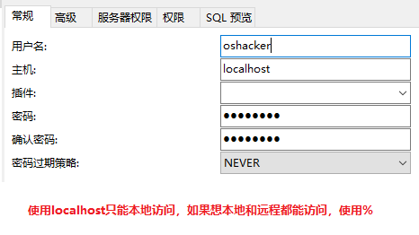
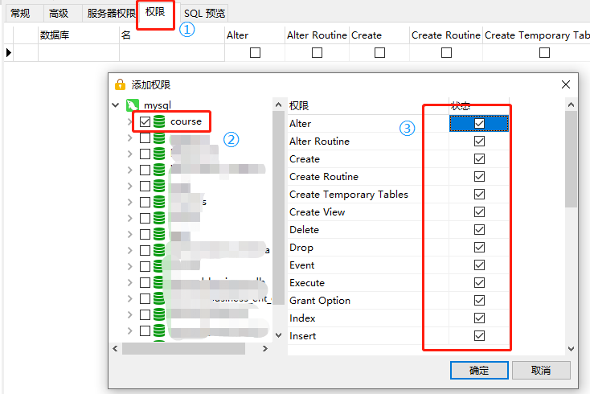
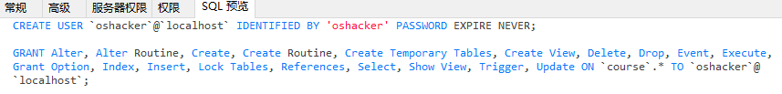
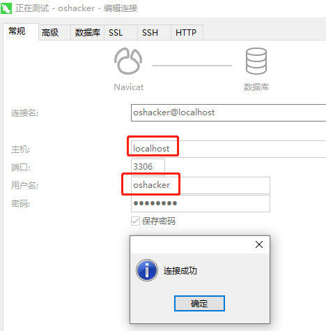

# 问题：用root用户连接数据库，能看到所有的项目，且对所有的库具有所有的权限，这是恐怖的！如何解决？

## 创建course数据库专用的用户oshacker

## 添加权限

## 以上两步生成的sql

在实际开发中，我们会创建不同权限的用户，比如只能查询数据，或者执政做增删改查。

## 使用创建的用户登录

连接上后，打开连接可能会有报错如下：

1142 - SELECT command denied to our user 'oshacker'@'localhost' for table 'user'

不用理它，直接使用就可以了

